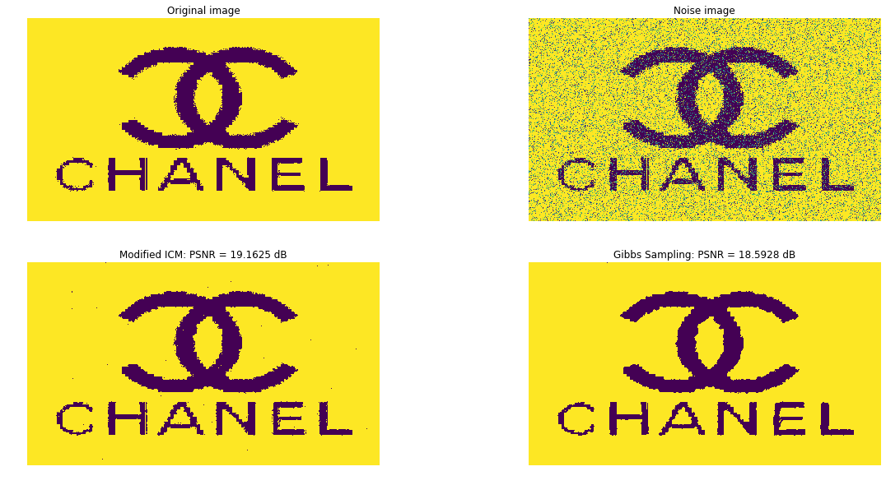
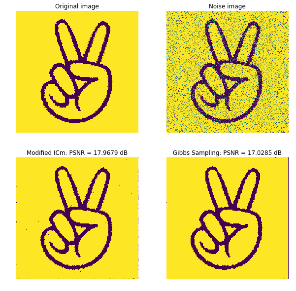
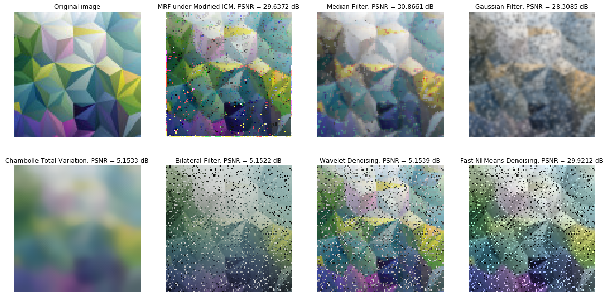

# Applying Markov Random Fields in Image De-noising

This is a project about applying Markov Random Fields(MRF) in Keras for Image De-noising. The detail of the mechanisms for building modified Iteration Conditional Modes(ICM) and Gibbs sampling in MRF was shown in `Report.pdf`.

## Data

The original dataset applied for noising and denoising could be divided into two parts:
1. binary images:
In this case, two binary images as: data/sample1.jpg, data/sample3.jpg with low resolution are chosen for comparing ICM and Gibbs sampling for denoising in MRF.
2. RGB images:
Furthermore, RGB image as: data/sample6.jpg with low resolution are chosen for comparing ICM and Gibbs sampling for denoising in MRF for more complex data structure cases.

## noising of images:
In this project, images were noised with pepper noise where pixels in random locations were chosen to reset to random valid values. In detail, for binary images with single channel, pepper noise was added in the only layer. While, for RGB image with three channels, pepper noise was added in each layer independently.

## denoising of images:
Initially, MRF was built specifically for the target noised image where MRF have similar shape with the image and each node inside of MRF initialized with value from correspond location in image. For denoising during iterative process, two value updating methods for nodes' value by its 8 neighbors were applied(To be mentioned, consider the node of boarders could not have 8 neighbors, 1 extra layer (value 0 for binary and 255 for RGB) was padding around each channel of images):

1. Gibbs Sampling.

2. modified Iteration Conditional Modes(ICM): It is a iterative method for updaing values of nodes from MRF based on the base/original neighbors' values initially in each iteration.

For the machanisms for updating node's value from its neighbors, three aspects were considered:

1. The closeness of candidate value of target node with its neighbors'.

2. The gardient of its neighbors of target node.

3. The Feature of its neighbors of target node: Since in this case, the block (3 * 3) considered for each node is small, the feature assumed is line going through the center of the block where target node should have similar value with neighbors in same feature. Further detail could be checked in `Report.pdf`.

## comparsion:
As result, Gibbs Sampling is better than ICM in binary denoising. 

ICM is much better than Gibbs Sampling in colorful denoising. 
For further study, ICM was compared with other API in denoising in RGB denoising. Further detail could be checked in `Report.pdf`.

## Code:

1. code/binary_noised.py: Noising binary images.

2. code/binary_denoised.py: Denoising binary images with MRF in Gibbs Sampling and ICM.

3. code/colorful_noised.py: Noising colorful(RGB) image.

4. code/colorful_denoised.py: Denoising colorful(RGB) image with MRF in Gibbs Sampling and ICM.

5. code/psnr.py: Calculating the psnr value by denoised image and original version.

6. test.py: Combined file for runing Noising and Denoising for both image cases.

7. sample_code.ipynb: Notebook for estalishing the running process and results of whole project.

## Resource
http://stanford.edu/class/ee367/Winter2018/yue_ee367_win18_report.pdf
